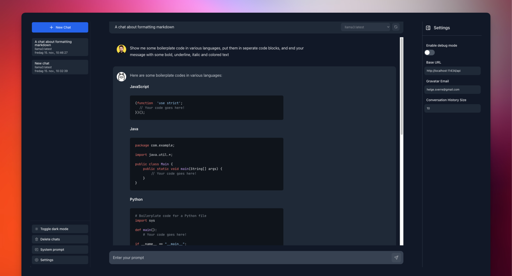

<p align="center">
  
</p>

# Ollama GUI: Web Interface for chatting with your local LLMs.

Ollama GUI is a web interface for [ollama.ai](https://ollama.ai/download), a tool that enables running Large
Language Models (LLMs) on your local machine.

## 🛠 Installation

### Prerequisites

1. Download and install [ollama CLI](https://ollama.ai/download).

```bash
ollama pull <model-name>
ollama serve
```

### Getting Started

2. Clone the repository and start the development server.

```bash
git clone https://github.com/HelgeSverre/ollama-gui.git
cd ollama-gui
yarn install
yarn dev
```

**Or use the hosted web version**, by running ollama with the following origin command [(docs)](https://github.com/jmorganca/ollama/blob/main/docs/faq.md#how-can-i-expose-the-ollama-server)

```shell
OLLAMA_ORIGINS=https://ollama-gui.vercel.app ollama serve
```

---

## Models

For convenience and `copy-pastability`, here is a table of interesting models you might want to try out.

For a complete list of models Ollama supports, go
to [ollama.ai/library](https://ollama.ai/library 'ollama model library').

| Model                | Parameters | Size  | Download                           |
| -------------------- | ---------- | ----- | ---------------------------------- |
| Mistral              | 7B         | 4.1GB | `ollama pull mistral`              |
| Mistral (instruct)   | 7B         | 4.1GB | `ollama pull mistral:7b-instruct`  |
| Llama 2              | 7B         | 3.8GB | `ollama pull llama2`               |
| Code Llama           | 7B         | 3.8GB | `ollama pull codellama`            |
| Llama 2 Uncensored   | 7B         | 3.8GB | `ollama pull llama2-uncensored`    |
| Orca Mini            | 3B         | 1.9GB | `ollama pull orca-mini`            |
| Vicuna               | 7B         | 3.8GB | `ollama pull falcon`               |
| Vicuna               | 7B         | 3.8GB | `ollama pull vicuna`               |
| Vicuna (16K context) | 7B         | 3.8GB | `ollama pull vicuna:7b-16k`        |
| Vicuna (16K context) | 13B        | 7.4GB | `ollama pull vicuna:13b-16k`       |
| nexusraven           | 13B        | 7.4gB | `ollama pull nexusraven`           |
| starcoder            | 7B         | 4.3GB | `ollama pull starcoder:7b`         |
| wizardlm-uncensored  | 13B        | 7.4GB | `ollama pull  wizardlm-uncensored` |

## 📋 To-Do List

- [x] Properly format newlines in the chat message (PHP-land has `nl2br` basically want the same thing)
- [x] Store chat history using IndexedDB locally
- [x] Cleanup the code, I made a mess of it for the sake of speed and getting something out the door.
- [x] Add markdown parsing [lib](https://dev.to/matijanovosel/rendering-markdown-in-vue-3-3maj)
- [ ] Allow browsing and installation of available models (library)
- [ ] Ensure mobile responsiveness (non-prioritized use-case atm.)
- [ ] Add file uploads with OCR and stuff.

---

## 🛠 Built With

- [Ollama.ai](https://ollama.ai/) - CLI tool for models.
- [LangUI](https://www.langui.dev/)
- [Vue.js](https://vuejs.org/)
- [Vite](https://vitejs.dev/)
- [Tailwind CSS](https://tailwindcss.com/)
- [VueUse](https://vueuse.org/)
- [@tabler/icons-vue](https://github.com/tabler/icons-vue)

---

## 📝 License

Licensed under the MIT License. See the [LICENSE.md](LICENSE.md) file for details.
