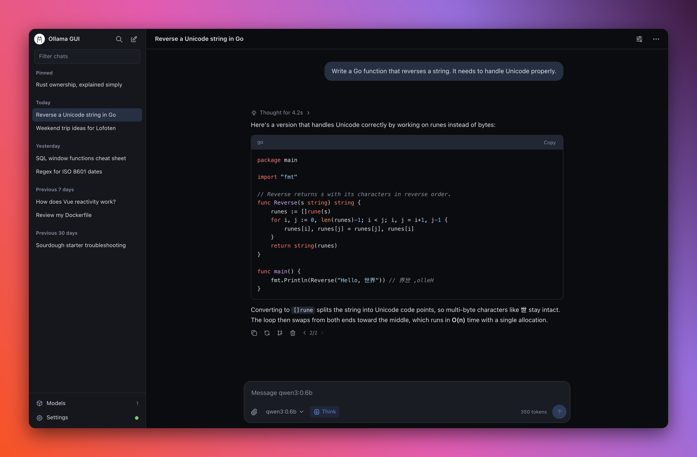

<p align="center">
  
</p>

<h1 align="center">Ollama GUI</h1>
<p align="center">A web interface for chatting with local models through Ollama.</p>

<p align="center">
  <a href="https://ollama.com"></a>
  <a href="https://github.com/HelgeSverre/ollama-gui/blob/main/LICENSE.md"></a>
  <a href="https://ollama-gui.vercel.app"></a>
</p>

Ollama GUI is a single-page app that talks directly to the Ollama API from your browser. There is no backend of its own: chats are stored in the browser's IndexedDB and never leave your machine except to reach the Ollama server you point it at.

## Features

- **Chat:** streaming replies that you can stop, regenerate or edit. Edits and regenerations are kept as versions you can switch between, and any reply can be branched into a new chat.
- **Thinking models** such as qwen3, deepseek-r1 and gpt-oss: the reasoning is shown in a collapsible block, and you can turn thinking on or off (or set the effort level for gpt-oss).
- **Attachments:** images for vision models (llava, gemma3), and text or code files, which are added to the message.
- **Models:** search the Ollama library as you type and pick a size, then pull with progress. Also delete, inspect capabilities and context length, and unload models from memory.
- **Settings:** system prompt and generation parameters (temperature, `num_ctx`, `top_p`, seed and others), set globally, per model or per chat.
- **History:** chats grouped by date, with pinning, archiving, renaming, generated titles and full-text search (⌘K).
- **Markdown** with syntax highlighting and math (KaTeX).
- **Appearance:** light and dark themes; dates and numbers follow your locale or a format you pick.
- **Import and export:** all chats as JSON, or a single chat as Markdown.

### Keyboard shortcuts

| Shortcut | Action |
|---|---|
| `⌘/Ctrl K` | Search chats and messages, run commands |
| `⌘/Ctrl ⇧ O` | New chat |
| `⌘/Ctrl ⇧ ⌫` | Delete the current chat |
| `Enter` / `⇧ Enter` | Send / new line |
| `Esc` | Stop generating |
| `↑` (in an empty message box) | Edit your last message |

## Getting started

You need [Ollama](https://ollama.com/download) running, plus [Bun](https://bun.sh) and Node.js 20 or newer for development.

```bash
ollama pull llama3.2      # any model works; you can also pull from the app
ollama serve

git clone https://github.com/HelgeSverre/ollama-gui.git
cd ollama-gui
bun install
bun run dev               # http://localhost:5173
```

The dev server forwards `/api` to `http://localhost:11434`, so Ollama needs no CORS configuration. With `bun run dev --host`, other devices on your network can use the app as well. To use an Ollama instance elsewhere, set its URL under Settings → Connection, or start the dev server with `VITE_NO_PROXY=true`.

### Where chats are stored

IndexedDB is scoped to the exact origin the app is served from. `localhost:5173`, `127.0.0.1:5173`, another port, another browser and a private window each have their own, separate history. For this reason the dev server always uses port 5173 and fails to start if the port is taken, rather than silently moving to another one. Use Settings → Data to export and import chats, or to ask the browser to keep the data persistently.

### Hosted version

The [hosted version](https://ollama-gui.vercel.app) runs in your browser and connects to your local Ollama. Allow its origin when starting Ollama:

```bash
OLLAMA_ORIGINS=https://ollama-gui.vercel.app ollama serve
```

### Docker

The image serves the app with nginx and proxies `/api` to Ollama, so the browser only talks to one origin and `OLLAMA_ORIGINS` isn't needed.

```bash
# Ollama and the GUI together, at http://localhost:8080
docker compose up -d

# Only the GUI, using Ollama on the host machine
docker run -d -p 8080:80 --add-host=host.docker.internal:host-gateway ghcr.io/helgesverre/ollama-gui

# Only the GUI, using Ollama on another machine
docker run -d -p 8080:80 -e OLLAMA_URL=http://gpu-box:11434 ghcr.io/helgesverre/ollama-gui
```

`OLLAMA_URL` sets where nginx forwards API requests (default `http://host.docker.internal:11434`). Images are published for amd64 and arm64; tags follow releases (`latest`, `2.0.0`, `2.0`). To build your own, run `docker build -t ollama-gui .`. In `compose.yml`, uncomment the `deploy` block to give Ollama GPU access. Models are stored in `./ollama_data`.

## Deploying

`bun run build` writes a static site to `dist/`. The browser must be able to reach Ollama, which you can arrange in one of two ways:

- **Same origin:** serve `dist/` behind a reverse proxy that forwards `/api/` to Ollama, and build with `VITE_OLLAMA_URL=/`. `nginx/default.conf.template` is a working example.
- **Different origin:** build with `VITE_OLLAMA_URL=https://ollama.example.com` (users can also change it in Settings), and start Ollama with `OLLAMA_ORIGINS=https://your-domain.com`.

## Development

```bash
bun run lint       # ESLint
bun run test       # Vitest unit and integration tests
bun run test:coverage  # the same, with a coverage report
bun run test:e2e   # Playwright, against a mocked Ollama API
bun run build      # type-check and production build
```

`e2e/real-ollama.spec.ts` runs the attachment and vision flows against a real Ollama instead of the mock. It's skipped by default:

```bash
ollama pull qwen3-vl:2b && ollama pull qwen3:0.6b
OLLAMA_REAL=1 bun run test:e2e real-ollama
```

The model search uses a snapshot of the Ollama library in `src/data/model-catalog.json`, built with [ollama-library-scraper](https://github.com/HelgeSverre/ollama-library-scraper). Refresh it with `bun run catalog:update`. The app itself never contacts ollama.com.

See `CLAUDE.md` for an overview of the code structure.

Built with [Vue](https://vuejs.org/), [Vite](https://vitejs.dev/), [Tailwind CSS](https://tailwindcss.com/), [VueUse](https://vueuse.org/), [Dexie](https://dexie.org/), [markdown-it](https://github.com/markdown-it/markdown-it), [highlight.js](https://highlightjs.org/), [KaTeX](https://katex.org/) and [Tabler Icons](https://tabler.io/icons).

## License

[MIT](LICENSE.md)
